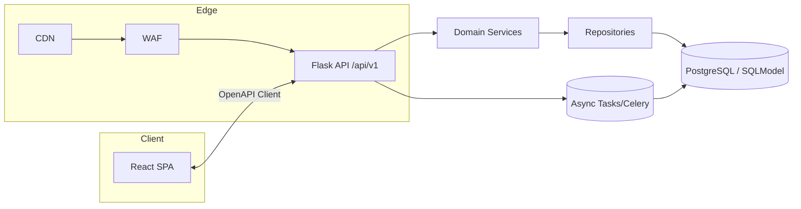

## Target Architecture

### 1. Scope & Goals
- Support multiple training domains (initially Poker and Blackjack) under a single "Jack of All Trades" platform.
- Allow each game to expose one or more **game modes** (e.g., Hold'em cash, Hold'em tournaments, Blackjack single-shoe) without duplicating core infrastructure.
- Enforce code quality (PEP 8/257, mypy, eslint/tsc --strict, 80%+ coverage) and security/resilience guardrails before shipping.

### 2. High-Level System View

### 3. Domain Partitioning
- **Games registry (`app/routes/games.py`)** exposes metadata for available games/modes (single-player only) and surfaces player progression/points leaderboards for comparison, not head-to-head play.
- **Poker module**: `app/routes/poker/`, `app/services/poker/`, `app/repositories/poker/`, `app/schemas/poker/`. Initial modes include **self-steered table** (user controls every seat to rehearse ranges) with sub-options for **pre-flop only** or **full-hand** simulations.
- **Blackjack module**: mirrored layout under `app/routes/blackjack/` etc., starting with a single training mode that supports configurable player-controlled slots (1..N) and optional automated seats to practice card counting cadence.
- **Future games**: extend by copying the module pattern; shared utilities live in `common/` to avoid repeated logic.

### 4. Backend Architecture (Flask / Python)
- **Core**
  - `core/config.py`: Base/Dev/Prod configs sourced from env, secrets mounted via vault/secret manager; feature flags per game/mode.
  - `core/logging.py`: Structured JSON logs, correlation/request IDs, OpenTelemetry exporter hooks.
  - `core/security.py`: JWT/session helpers, CSRF (for server-rendered flows), CORS rules for SPA, rate limiting (Flask-Limiter) per IP+user.
- **Blueprint layout**
  - `/api/v1/<game>/<mode>/...` with Marshmallow/Pydantic schemas for request/response validation.
  - `app/services/*` hold business rules (range calculations, EV simulations) decoupled from Flask context.
  - `app/repositories/*` wrap SQLModel/SQLAlchemy models under `db/models/*.py`; repository pattern ensures unit-testable persistence.
- **Data & contracts**
  - OpenAPI definition in `docs/api/openapi.yaml`; python/TypeScript clients generated during build to guarantee parity.
  - Alembic migrations kept under `db/migrations/` per module; cross-game tables share naming via prefixes (`poker_`, `blackjack_`).
- **Async & long-running work**
  - Celery (or APScheduler for cron-like tasks) defined in `infrastructure/tasks.py` for simulations, training batch jobs, etc., with retry/backoff.

### 5. Frontend Architecture (React + TypeScript)
- **Structure**: `frontend/src/`
  - `features/<game>/<mode>/` for domain-specific UI logic.
  - `components/` (pure, reusable), `hooks/` (custom React hooks), `lib/` (helpers), `api/` (OpenAPI-generated client + fetch wrappers), `styles/`, `tests/`.
  - React Router for navigation, Suspense/code splitting per feature to control bundle size.
- **Data layer**: React Query handles server cache; mutations integrate optimistic updates and invalidation keyed by `game` + `mode`.
- **Testing**: Vitest/Jest + React Testing Library for components; MSW for API mocks; Playwright/Cypress for e2e smoke per critical flow.
- **Accessibility & security**: ARIA-compliant components, keyboard navigation, sanitized HTML, tokens stored in `Secure`, `SameSite=Strict` cookies; document CSP in deployment guides.

### 6. Observability & Operations
*(Observability deferred per current scope; reinstate once usage justifies the overhead.)*

### 7. Security & Privacy
- Enforce least-privilege DB roles; migrations validated before prod deploy.
- Input validation on every POST/PUT; server-side schema enforcement rejects unknown fields.
- Secure headers via Flask-Talisman (HSTS, X-Frame-Options, etc.).
- API rate limits per user/session and per IP; anti-CSRF tokens for any cookie-auth flows.
- PII minimization: store only necessary player data; encrypt sensitive columns at rest when applicable.

### 8. Quality Gates & CI
- Pre-commit runs `black`, `ruff`, `mypy`, `pytest`, `bandit`, `safety`, frontend `eslint`, `tsc --noEmit`, `vitest --runInBand`, `jest-axe` for accessibility checks.
- CI/CD stages: lint/type → unit/integration → e2e smoke → build artifacts (Docker images for API & static bundle) → deploy via blue/green.
- Definition of Done: requirements clarified, architecture alignment reviewed, code/tests/docs updated, local + CI green, manual smoke run captured, change log / ADR touched when needed. Test coverage target is **80%** overall; exceptions allowed for glue code, data classes without logic, or external SDK adapters where mocks add no value, provided the rationale is documented in the PR/ADR.

### 9. Redundant Code Reduction Strategy
1. **Inventory & categorize**
   - Use `rg --files -0 | xargs -0 file` + `git status -sb` to detect generated assets (coverage, build outputs, venvs) and confirm `.gitignore` gaps.
2. **Consolidate shared logic**
   - Move duplicate helpers into `common/` (Python) or `frontend/src/lib/`; expose via clear interfaces to prevent re-copying per game.
3. **Prune unused modules**
   - For each game, keep only active blueprints/services; confirm usage via `rg` before deletion. Remove experimental or deprecated folders if they have zero references and no tests.
4. **Drop build artifacts & vendor bundles**
   - Ensure `frontend/dist/`, `.pytest_cache/`, `.ruff_cache/`, coverage reports, and virtualenvs are ignored and deleted from VCS.
5. **Test-backed verification**
   - Snapshot current behavior with unit/integration tests; after deletions, rerun `pytest`, `mypy`, `eslint`, and frontend tests to guarantee no regressions.
6. **Document every removal**
   - Update ADR or release notes summarizing what was removed, rationale, and migration path (if any) so other contributors understand the cleanup.

### 10. Immediate Next Steps
- Publish OpenAPI spec draft covering Poker + Blackjack endpoints.
- Identify the 2400+ modified files, tag each as `keep/remove/regenerate`, and schedule deletions in small, reviewable batches.
- Backfill missing tests (especially for shared services) before deeper refactors.
